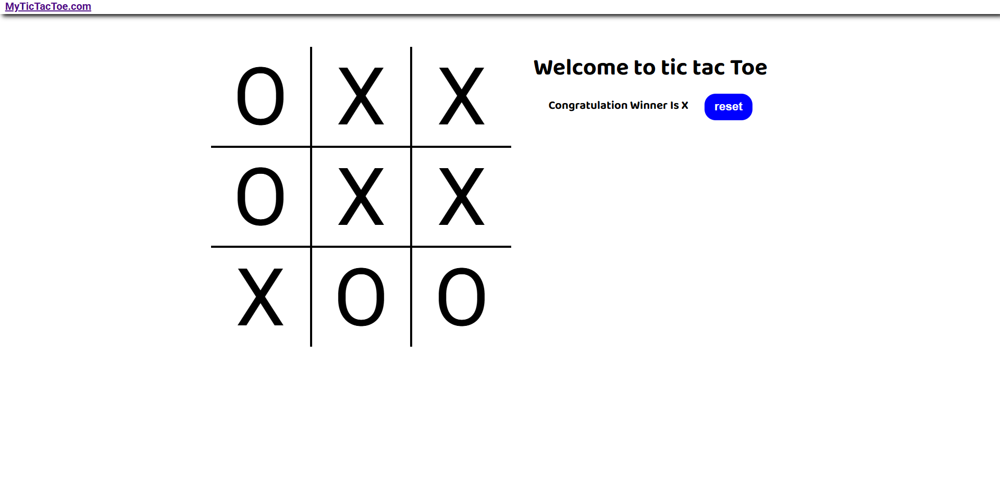

# Tic Tac Toe Game 🎮

A simple **Tic Tac Toe** game built using **HTML**, **CSS**, and **JavaScript**. This classic game lets two players compete to form a line of three X's or O's.

## Features
- **Two-player gameplay**: Players take turns marking their symbol (X or O) on the grid.
- **Dynamic win detection**: The game automatically detects wins, losses, or ties.
- **Interactive design**: Responsive layout and intuitive UI for all devices.
- **Restart button**: Quickly reset the game to play again.

## Game Rules
- The game is played on a 3x3 grid.
- Players take turns placing their symbol (X or O) in an empty square.
- The first player to get **three of their symbols in a row** (horizontally, vertically, or diagonally) wins.
- If all nine squares are filled and no player has three in a row, the game ends in a draw.

## Screenshot

## How to Play
1. Clone or download this repository.
2. Open the `index.html` file in any modern web browser.
3. Take turns clicking on the grid to place your symbol.
4. Check for a winner or a draw.
5. Use the restart button to play again.

## Technology Used
- **HTML**: Structure of the game.
- **CSS**: Styling for the game board and elements.
- **JavaScript**: Game logic and interactivity.

---

Enjoy playing Tic Tac Toe! 😊
